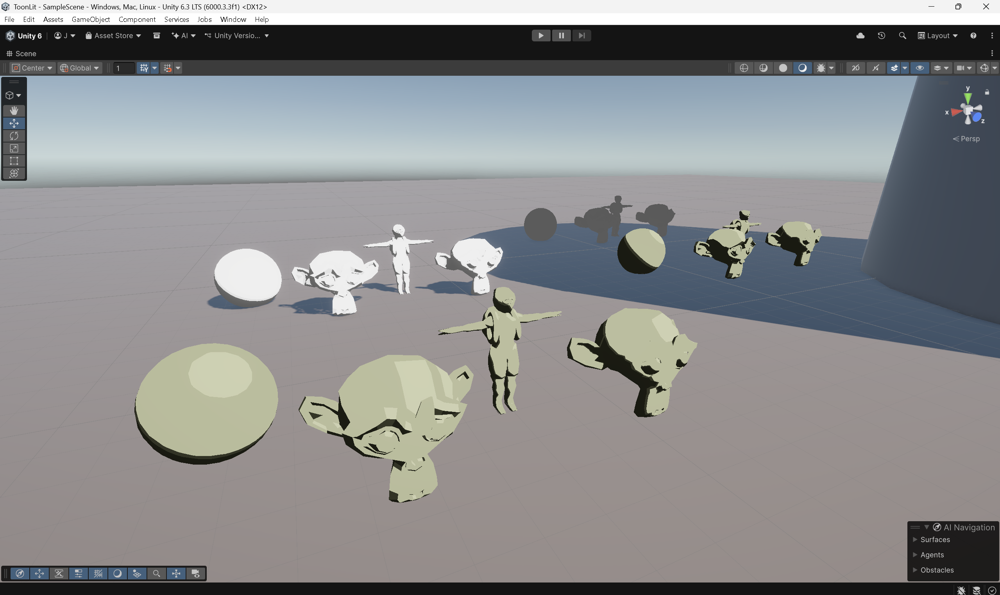

# ToonLitUnity
A WIP HLSL shader designed for Unity that does toon-style lighting supporting shadows and multiple lights.

## Planned Features
- Shadow casting and self-shadowing (partially implemented in shadergraph already)
- Support for directional and point lights
- Outlines (potentially as a post-process or render feature)

  

